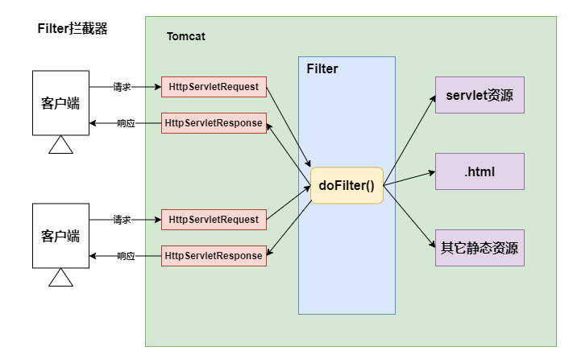
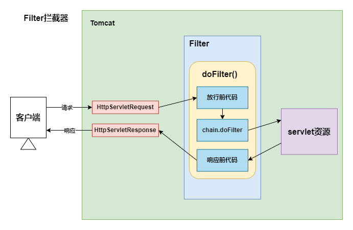
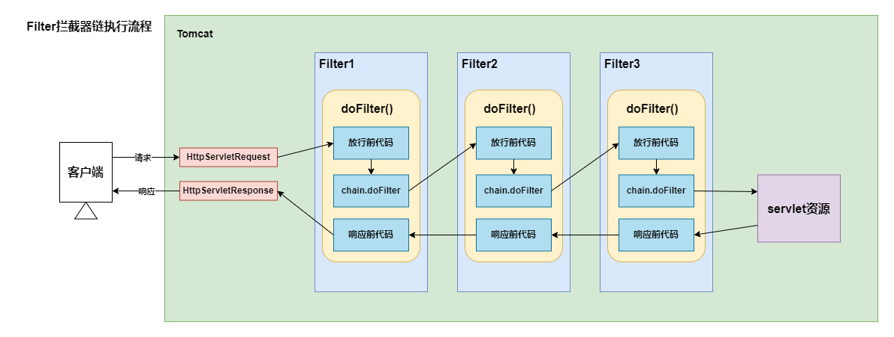
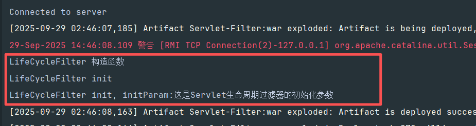
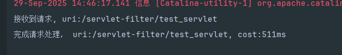
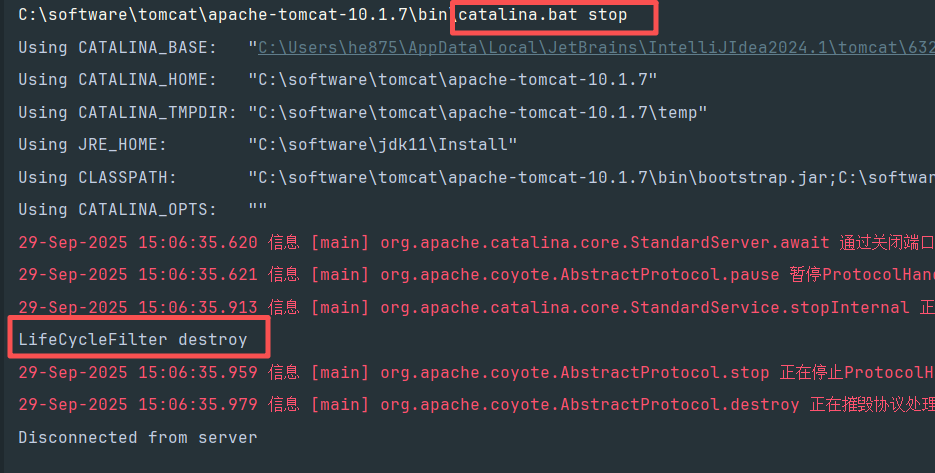

[toc]

# 过滤器


## 过滤器概述

`Filter` 即过滤器，是 `Java EE` 技术规范之一，作为目标资源的请求进行过滤的一套技术规范，是 `Java Web` 项目中最为实用的技术之一;

- `Filter` 接口定义了过滤器的开发规范，所有的过滤器都要实现该接口;
- `Filter` 的工作位置是项目中所有目标资源之前，容器在创建 `HttpServletRequest` 和 `HttpServletResponse` 之后，会先调用 `Filter` 的 `doFilter()` 方法;
- `Filter` 的 `doFilter()` 方法可以控制请求是否继续
  - 如果放行，则请求继续;
  - 如果拒绝，则请求到此为止，由过滤器本身做出响应;
- `Filter` 不仅可以对请求做出过滤，也可以在目标资源做出响应前，对响应再次进行处理;
- `Filter` 是 `GOF` 中责任链模式的典型案例;
- `Filter` 的常用应用包括但不限于：登录权限检查、解决网站乱码、过滤敏感字符、日志记录、性能分析...;



## `web.xml` 配置过滤器

```xml
<!-- 配置过滤器 -->
<filter>
    <filter-name>logFilter</filter-name>
    <filter-class>com.example.servlet.filter.LogFilter</filter-class>
</filter>

<!-- 配置过滤器拦截的路径 -->
<filter-mapping>
    <filter-name>logFilter</filter-name>
    <!--
        url-pattern: 根据 servlet 的请求路径进行过滤
            /*: 过滤所有资源
            /a/*: 过滤以 /a 开头的所有资源
            *.html: 过滤以 html 结尾的所有资源
            /servlet_a: 过滤指定servlet资源
        servlet-name: 根据 servlet 的别名，对指定的servlet资源进行拦截

       在 filter-mapping 内部可以同时写多个 url-pattern 和 servlet-name 标签
    -->
    <url-pattern>/*</url-pattern>
</filter-mapping>
```

- `<filter-mapping/>` 标签中定义了过滤器对哪些资源进行过滤;
- 子标签 `<url-pattern/>` 通过映射的路径确定过滤的范围;
  - 精确匹配 `/servletA`, 表示对 `/servletA` 资源的请求进行过滤;
  - 模糊匹配 `*.html`，表示对以 `.html` 结尾的路径进行过滤;
  - `/*` 表示对所有资源进行过滤;
  - 一个 `<filter-mapping/>` 标签内部可以配置多个 `url-pattern`;
- 子标签 `<servlet-name/>` 通过 `servlet` 别名确定对哪些 `servlet` 进行过滤;
  - 使用该标签确定目标资源的前提是 `servlet` 起了别名;
  - 一个 `<filter-mapping/>` 标签下可以定义多个 `<servlet-name/>`;
  - 一个 `<filter-mapping/>` 标签下，`<servlet-name/>` 和 `<url-pattern/>` 标签可以同时存在;



## 过滤器链的顺序

一个 `web` 项目可以同时顶一个多个过滤器，多个过滤器对同一个资源进行过滤时，工作位置有先有后，整体形成一个工作链，成为过滤器链;

- 过滤器链中的过滤器的顺序由 `<filter-mapping>` 标签在 `web.xml` 中的顺序决定;
- 每个过滤器的过滤范围不同，针对不同的资源来说，过滤器链中的过滤器个数可能是不同的;
- 如果某个 `Filter` 是使用 `servlet-name` 进行匹配匹配规则的配置，那么这个 `Filter` 执行的优先级更低;



## 过滤器的生命周期

过滤器作为 `web` 项目的组件之一，和 `servlet` 的生命周期类似，略有不同，没有 `servlet` 的 `load-on-startup` 配置，默认就是系统启动，立即构造;

| 阶段    | 对应方法                                                                     | 执行时机     | 执行次数 |
|-------|--------------------------------------------------------------------------|----------|------|
| 创建对象  | 构造函数                                                                     | web应用启动时 | 1    |
| 初始化方法 | `void init(FilterConfig filterConfig)`                                   | 过滤器构造完毕  | 1    |
| 过滤请求  | `doFilter(ServletRequest req, ServletResponsne resp, FilterChain chain)` | 每次请求     | 多次   |
| 销毁    | `default void destroy()`                                                 | web应用关闭时 | 1    |


`web` 程序启动后，过滤器的构造函数和初始化函数被立即执行;



发送请求，过滤器过滤请求



关闭容器，执行过滤器销毁




