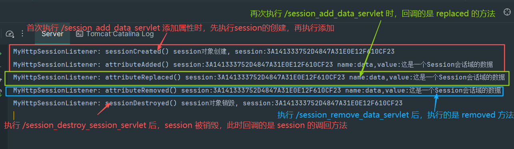

[toc]


# 监听器

## 监听器概述

监听器专门用于对 **域对象** 身上身上发生的事件或状态改变进行监听和相应处理的对象;

- 监听器是 `GOF` 设计模式中，观察者模式的典型案例;
- 监听器使用的感受类似 JS 中的事件，被观察的对象发生某些情况时，自动触发代码的执行;
- 监听器并不监听 web项目中的所有组件，仅仅是对三大域对象做相关的事件监听;

监听器的分类, web 中定义八个监听器接口作为监听器的规范，这八个接口按照不同的标准可以形成不同的分类:

> 按监听的对象划分:

- `application` 域监听器 `ServletContextListener`、`ServletContextAttributeListener`;
- `session` 域监听器 `HttpSessionListener`、`HttpSessionAttributeListener`、`HttpSessionBindingListener`、`HttpSessionActivationListener`;
- `request` 域监听器 `ServletRequestListener`、`ServletRequestAttributeListener`;

> 按监听的事件划分:

- 域对象的创建和销毁监听器 `ServletContextListener`、`HttpSessionListener`、`ServletRequestListener`;
- 域对象数据增删改事件监听器 `ServletContextAttributeListener`、`HttpSessionAttributeListener`、`ServletRequestAttributeListener`;
- 其它监听器 `HttpSessionBingdingListener`、`HttpServletActivationListener`;

## 应用域监听器 `ServletContextListener`、`ServletContextAttributeListener` 的使用

> `ServletContextListener` 监听 `ServletContext` 对象的创建和销毁

- `contextInitialized(ServletContextEvent sce)`: `ServletContext` 创建时调用;
- `contextDestroyed(ServletContextEvent sce): `ServletContext` 销毁时调用;
- `ServletContextEvent`: 表示从 `ServletContext` 对象上捕获到的事件，通过这个事件可以获取到 `ServletContext` 对象;

> `ServletContextAttributeListener` 监听 `ServletContext` 应用域对象属性的 添加、修改、删除操作;

- `attributeAdded(ServletContextAttributeEvent event)`: 向 `ServletContext` 应用域中添加属性时调用;
- `attributeReplaced(ServletContextAttributeEvent event)`: 当 `ServletContext` 应用域中的属性被修改时调用 (即插入的 `key` 已经存在时);
- `attributeRemoved(ServletContextAttributeEvent event)`: 从 `ServletContext` 应用域中删除属性时调用;
- `ServletContextAttributeEvent`: 表示属性变化事件，包含如下方法:
  - `String getName()`: 获取添加/修改的属性的属性名;
  - `Object getValue()`: 获取被修改/添加的属性值;
  - `ServletContext getServletContext()`: 获取 `ServletContext` 对象;


```java
@WebListener
public class MyApplicationListener implements ServletContextListener, ServletContextAttributeListener {

    @Override
    public void contextInitialized(ServletContextEvent sce) {
        ServletContext servletContext = sce.getServletContext();
        System.out.println("MyApplicationListener: 应用域初始化了 contextInitialized(), servletContext: " + servletContext.hashCode());
    }

    @Override
    public void contextDestroyed(ServletContextEvent sce) {
        ServletContext servletContext = sce.getServletContext();
        System.out.println("MyApplicationListener: 应用域销毁了 contextDestroyed(), servletContext: " + servletContext.hashCode());
    }

    @Override
    public void attributeAdded(ServletContextAttributeEvent event) {
        ServletContext servletContext = event.getServletContext();
        String name = event.getName();
        Object value = event.getValue();
        System.out.println("MyApplicationListener: 应用域添加了数据 attributeAdded(), servletContext: " + servletContext.hashCode() + ", key:" + name + ", value:" + value);
    }

    @Override
    public void attributeReplaced(ServletContextAttributeEvent event) {
        ServletContext servletContext = event.getServletContext();
        String name = event.getName();
        Object value = event.getValue();
        System.out.println("MyApplicationListener: 应用域修改了数据 attributeReplaced(), servletContext: " + servletContext.hashCode() + ", key:" + name + ", value:" + value);
    }

    @Override
    public void attributeRemoved(ServletContextAttributeEvent event) {
        ServletContext servletContext = event.getServletContext();
        String name = event.getName();
        Object value = event.getValue();
        System.out.println("MyApplicationListener: 应用域删除了数据 attributeRemoved(), servletContext: " + servletContext.hashCode() + ", key:" + name + ", value:" + value);
    }
}
```

执行 启动应用 -> 添加数据 -> 再次添加数据 -> 删除数据 -> 关闭应用 操作，得到如下的监听器日志


## 会话域监听器 `HttpServletListener`、`HttpServletAttributeListener`

> `HttpServletListener` 监听 `HttpSession` 对象的创建与销毁;

- `sessionCreated(HttpSessionEvent hse)`: `HttpSession` 对象创建时调用;
- `sessionDestroy(HttpSessionEvent hse)`: `HttpSession` 对象销毁时调用;
- `HttpSessionEvent`: 表示从 `HttpSession` 对象上捕获到的事件，通过该对象可以获取到触发该事件的 `HttpSession` 对象;


> `HttpSessionAttributeListener` 监听 `HttpSession` 中属性的添加、删除和修改;

- `attributeAdded(HttpSessionBindingEvent se)`: 向 `HttpSession` 中添加属性时调用;
- `attributeReplaced(HttpSessionBindingEvent se)`: 修改 `HttpSession` 中的属性时调用;
- `attributeRemoved(HttpSessionBindingEvent se)`: 从 `HttpSession` 中移除属性时调用;
- `HttpSessionBindingEvent`: 表示 `HttpSession` 属性变化的事件，包含如下方法:
  - `String getName()`: 获取属性名称;
  - `Object getValue()`: 获取属性值;
  - `HttpSession getSession()`: 获取该事件对应的 `HttpSession` 对象;

[会话域监听器代码 `MyHttpSessionListener`](./src/main/java/com/example/servlet/listener/MyHttpSessionListener.java)

[会话域操作 servlet 相关代码](./src/main/java/com/example/servlet/session_domain)




## 请求域监听器 `ServletRequestListener`、`ServletRequestAttributeListener`

> `ServletRequestListener` 监听 `ServletRequest` 对象的创建和销毁

- `requestInitialized(ServletRequestEvent sre)`: `ServletRequest` 对象创建时调用;
- `requestDestroyed(ServletRequestEvent sre)`: `ServletRequest` 对象销毁时调用;
- `ServletRequestEvent`: 表示从 `ServletRequest` 对象上获取的事件，通过这个事件可以获取到触发事件的 `ServletRequest` 对象，此外还可以获取到当前 `web`应用的 `ServletContext` 对象;

> `ServletRequestAttributeListener` 监听 `ServletRequest` 对象属性的添加、修改和删除;

- `attributeAdded(ServletRequestAttributeEvent srae)`: 向 `ServletRequest` 中添加属性时调用;
- `attributeReplaced(ServletRequestAttributeEvent srae)`: 修改 `ServletRequset` 中属性时调用;
- `attributeRemoved(ServletRequestAttributeEvent srae)`: 删除 `ServletRequest` 中属性时调用;
- `ServletRequestAttributeEvent`: 表示 `ServletRequest` 属性变化事件，包含方法如下:
  - `String getName()`: 获取属性名称;
  - `Object getValue()`: 获取属性值;
  - `ServletRequest getServletRequest()`: 获取触发事件的 `ServletRequest` 对象;


