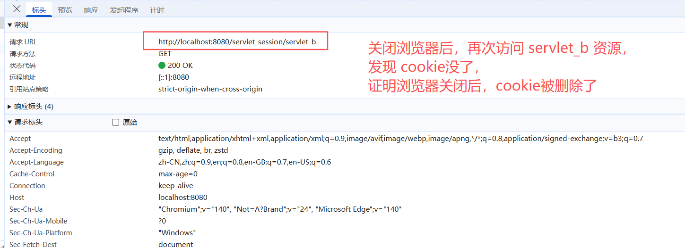

# 会话

## 会话管理概述

### 为什么需要会话

> HTTP是无状态协议

- 无状态就是不保存状态，即无状态协议 (`stateless`)，`HTTP` 协议自身不对请求和响应之间的通信状态进行保存，也就是说，在 `HTTP` 协议这个级别，协议对于发送请求或者响应都不作持久化处理;
- 简单理解，浏览器发送请求，服务器接收并相应，当时服务器不清楚这个请求来自于哪个浏览器，服务器没记录浏览器的特征(就是客户端的状态);

### 会话实现的手段

> `Cookie` 和 `Session` 配合解决

- `Cookie` 是在客户端保留少量数据的技术，主要通过响应头向客户端响应一些客户端要保留的信息;
- `Session` 是在服务端保留更多数据的技术，主要通过服务端 `HttpSession` 对象保存一些和客户端相关的信息;

## `Cookie`

`Cookie` 是一种客户端会话技术，`Cookie` 由服务端创建，它是服务器存放在浏览器的一小份数据，浏览器以后每次访问该服务器的时候都会将这份数据携带给服务器;

- 服务端创建 `Cookie`，将 `Cookie` 放入到响应对象中。`Tomcat` 容器将 `Cookie` 转化为 `set-cookie` 响应头，响应给客户端;
- 客户端在接收到 `set-cookie` 响应头时，在下次请求该服务的资源时，会以 `cookie` 请求头的形式携带之前接收到的 `Cookie` 信息;
- `Cookie` 是一种键值对格式的数据，从 `Tocmat8.5` 开始可以保存中文，但是不推荐;
- 由于 `Cookie` 是保存在客户端的数据，比较容易暴露，一般不存储一些敏感或者影响安全的数据;


> `HttpServletResponse` 响应报文响应头中的 `set-cookie`


> 浏览器解析到响应报文中的 `set-cookie` 响应头后，会取出对应的 cookie 信息，存储到本地


> 浏览器存储 cookie 后，在后续向该应用发送请求时(可以是任意的资源，也可以时不存在的资源)，都会带上cookie信息


> 浏览器关闭后，缓存的 cookie 会被删除




### `Cookie` 的时效性

默认情况下 `Cookie` 的有效期是一次会话范围内，我们可以通过 `Cookie` 的 `setMaxAge()` 方法，让 `Cookie` 持久化保存到浏览器上;

- 会话级 `Cookie`:
  - 服务端没有明确设置 `Cookie` 的存在时间;
  - 在浏览器端，`Cookie` 数据存在于内存中;
  - 只要浏览器不关闭，`Cookie` 数据就会一直存在 (注意: 即使是关闭了当前tab，只要是浏览器没关闭，则 `Cookie` 依然会存在);
  - 浏览器关闭，内存中的 `Cookie` 数据就会被释放;
- 持久化 `Cookie`:
  - 服务器端明确设置了 `Cookie` 的存在时间;
  - 在浏览器端，`Cookie` 数据会被保存到硬盘上;
  - `Cookie` 在硬盘上存在的时间根据服务器端限定的时间来管控，不受浏览器关闭的影响;
  - 持久化 `Cookie` 达到了预设的时间后会被释放;

```java
Cookie cookieToken = new Cookie("token", "123");
// 通过 Cookie.setMaxAge(expiry) 设置 cookie的持久化时间
// expiry 的单位是秒，如果设置成 0 ，则表示将浏览器中保存的该 Cookie 删除
cookieToken.setMaxAge(10);
resp.addCookie(cookieToken);
```


### 设置 Cookie 的提交路径

 cookie 可以通过 `Cookie.setPath()` 方法设置只有对应 `path` 的资源才会携带当前 cookie

> step1 通过 servletA 向客户端段返回 `cookie` 并配置 cookie 的有效路径

```java
Cookie cookieToken = new Cookie("token", "123");
// 通过 Cookie.setMaxAge(expiry) 设置 cookie的持久化时间
// expiry 的单位是秒，如果设置成 0 ，则表示将浏览器中保存的该 Cookie 删除
cookieToken.setMaxAge(10*60);
// 设置cookie的提交路径，表示当前 cookie 只有在请求 /servlet_session/servlet_c 这个资源的时候才会被提交
cookieToken.setPath("/servlet_session/servlet_c");
```

> step2 请求 `servletB` ，此时请求报文中不会携带 key 为 `token` 的 cookie


> step3 请求 `servletC`，此时虽然服务端没有 `servletC` 资源，但是请求依然会带上对应的 `Cookie`


## `Session`


