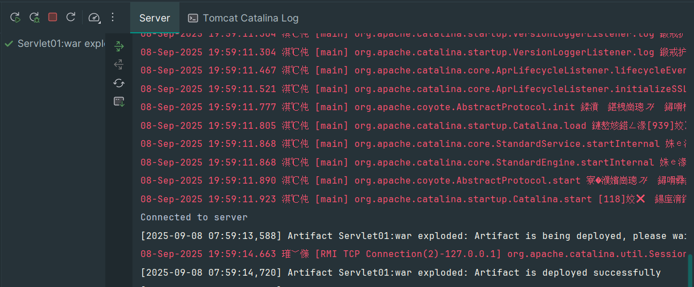

# Servlet

## url-pattern

1. 精确匹配: `/hello_servlet`
2. 模糊匹配:
    - 使用 `*` 作为通配符，`*` 在哪里，哪里就是模糊的;
    - `/` 匹配全部，不包含 `jsp` 文件;
    - `/*` 匹配全部，包含 `jsp` 文件;
    - `/a/*` 匹配前缀，后缀模糊;
    - `/*.html` 匹配后缀;

## Servlet生命周期

servlet 生命周期如下

| 生命周期 | 对应方法                                                        | 执行时机        | 执行次数 |
|------|-------------------------------------------------------------|-------------|------|
| 构造对象 | 构造器                                                         | 第一次请求或则启动容器 | 1    |
| 初始化  | `init()`                                                    | 构造完毕后       | 1    | 
| 处理服务 | `service(HttpServletRequest req, HttpServletResponse resp)` | 每次请求        | 多次   |
| 销毁   | `destroy()`                                                 | 容器关闭        | 1    |


> `load-on-startup` 如果配置的是正整数则表示容器在启动时就要实例化 `servlet`，数字大小表示实例化的顺序;

1. 通过 生命周期 测试发现，`servlet` 对象在容器中是单例的;
2. 容器是可以处理并发的用户请求的，每个请求在容器中都会开启一个线程;
3. 多线程可能会使用相同的 `servlet` 对象，所以在 `servlet` 中不要轻易定义一些需要经常修改的成员变量;
4. `load-on-startup` 中定义的正整数表示实例化顺序，如果数字重复了，容器自行解决实例化顺序问题，但是应该避免重复，数字越小越先实例化;
5. `tomcat` 容器中，已经定义了一些随系统启动实例化的 `servlet`，自定义的 `servlet` 的 `load-on-startup` 尽量不要使用 `1~5`;


# `ServletConfig` 和 `ServletContext`

## `ServletConfig`

`ServletConfig` 是为 `Servlet` 提供初始配置参数的对象，每个 `Servlet` 都有自己独立且唯一的 `ServletConfig` 对象;

`Servlet` 容器会为每个 `Servlet` 实例化一个 `ServletConfig` 对象，并通过 `Servlet.init(ServletConfig config)` 生命周期回调函数传递给 `Servlet` 对象;

```java
package jakarta.servlet;

import java.util.Enumeration;

public interface ServletConfig {
    // 获取 Servlet 的名称，在 web.xml 配置文件中 <servlet-name> 标签中的名称
    String getServletName();
    // 获取 ServletContext 对象
    ServletContext getServletContext();
    // 根据名称获取 servlet 的初始化参数，在 web.xml 配置文件中 <init-params> 标签下定义的 key-value 数据对
    String getInitParameter(String var1);
    // 获取所有初始化参数名组成的 Enumeration 对象
    Enumeration<String> getInitParameterNames();
}
```


## `ServletConfig` 和 `ServletContext`

### `ServletConfig`

- `ServletConfig` 为 `Servlet` 提供初始配置参数的一种对象，每个 `Servlet` 都有自己独立唯一的 `ServletConfig` 对象;
- 容器会为每一个 `Servlet` 实例化一个 `ServletConfig` 对象，并通过 `Servlet` 生命周期的 `init(ServletConfig config)` 方法传入给 `Servlet`;

```java
public interface ServletConfig {
    // 获取 <servlet-name>HelloServlet</servlet-name> 标签中定义的 servlet 名称
    String getServletName();
    // 获取 ServletContext 对象
    ServletContext getServletContext();
    // 根据 key 获取 <init-param></init-param> 中配置的 value
    String getInitParameter(String var1);
    // 获取所有的初始化配置键值对信息，封装在 Enumeration 对象中
    Enumeration<String> getInitParameterNames();
}
```

### `ServletContext`

- `ServletContext` 对象为 `Servlet` 上下文对象;
- 容器会为每一个 `app` 创建一个独立且唯一的 `ServletContext` 对象;
- `ServletContext` 对象为所有的 `Servlet` 所共享;
- `ServletContext` 对象可以为所有的 `Servlet` 提供初始配置参数;


> 获取资源的磁盘路径 

获取项目部署目录下的 dir 目录
`getServletContext().getRealPath("dir")`

> 获取项目的上下文路径

项目的部署名称，也叫项目的上下文路径，在部署进入 `tomcat` 时所使用的路径，该路径是可能发生变化的，通过该 `api` 可以动态获取项目真实的上下文路径。

`getServletContext().getContextPath()`

> 域对象的相关API

- 域对象: 一些用于在一些特定范围内存储数据和传递数据的对象，不同范围称为不同的域，不同域对象代表不同的域，共享数据的范围也不同。
- `ServletContext` 代表应用，所以 `ServletContext` 域也叫做应用域，是 `webapp` 中最大的域，可以在本应用内实现数据的共享和传递。
- `webapp` 中的三大域对象，分别是 应用域、会话域、请求域。
- 三大作用域对象都有如下API

| API                                           | 功能         |
|-----------------------------------------------|------------|
| `void setAttribute(String key, Object value)` | 向域中存储/修改数据 
| `Object getAttribute(String key)`             | 读取域中的数据    |
| `void removeAttribute(String key)`            | 移除域中的数据    |


# 请求转发和响应重定向

- 请求转发和响应重定向是web应用中间接访问项目资源的两种手段，也是 `servlet` 控制页面跳转的两种手段;
- 请求转发通过 `HttpServletRequest` 实现，响应重定向通过 `HttpServletResponse` 实现;

## 请求转发


- 请求转发通过 `HttpServletRequest` 对象获取请求转发器实现;
- 请求转发是服务器内部的行为，对客户端是屏蔽的;
- 客户端只发送了一次请求，客户端地址栏不变;
- 服务器只产生了一对 请求/响应 对象，这一对请求和响应对象会继续传递给下一个资源;
- 因为全程只有一个 `HttpServletRequest` 对象，所以请求参数也可以传递，请求域中的数据也可以传递;
- 请求转发可以转发给其它 `servlet` 动态资源，也可以转发给一些静态资源以实现页面跳转;
- 请求转发可以转发给 `WEB-INF` 下受保护的资源;
- 请求转发不能转发到本项目以外的外部资源;


对于客户端来说，只执行了一次请求


## 响应重定向


- 响应重定向通过 `HttpServletResponse` 对象的 `sendRedirect` 方法实现;
- 响应重定向是服务端通过 `302` 响应码和路径，告诉客户端要客户端自己去找其他资源，是在服务端提示下的客户端行为;
- 客户端至少发送了两次请求，客户端地址栏是要变化的;
- 服务端产生了多对 请求/响应 对象，且请求和响应对象不会传递给下一个资源;
- 因为全程产生了多个 `HttpServletRequest` 对象，所以请求参数不可以传递，请求域中的数据也不可以传递;
- 重定向可以是其它 `Servlet` 动态资源，也可以是一些静态资源以实现页面跳转;
- 重定向不可以给到 `WEB-INF` 目录下受保护的资源;
- 重定向可以跳转到本项目以外的外部资源;


可以看到 客户端发送了两次请求，原始请求地址的响应码为 302 ，表示当前需要客户端重定向，重定向的 URI 为 `redirect_target`


注意: 请求转发 和 响应重定向都可以实现页面跳转的场景下，优先使用响应重定向实现;


# 乱码和路径问题

## 乱码问题

乱码问题产生的根本原因是 数据的编码和解码使用的不是同一个字符集，或者使用了不支持某个语言文字的字符集;

### tomcat 控制台乱码



在 `tomcat10.1.7` 版本中，修改 `Tomcat/conf/logging.properties` 中，所有的 `UTF-8` 为 `GBK` 即可。


`sout` 乱码，设 `JVM` 载 `.class` 文件时使用 `UTF-8` 集。


输入内容 `-Dfile.encoding=UTF-8 -Dclient.encoding.override=UTF-8`


### 请求乱码

#### GET 请求乱码问题

- GET 请求提交参数的方式是将参数放到 URL 后面，如果使用的不是`UTF-8`，那么会对参数进行 `URL` 编码处理;
- HTML中的 `<meta charset='字符集'/>` 响了 `GET` 方式提交数的URL编码;
- `Tomcat10.1.7` 的 `URI` 编码为 `UTF-8`;
- 当 `GET` 方式提交的数 `URL` 编码和 `Tomcat10.1.7` 的 `URI` 编码不一时，就会出现乱码;

> 解决方案

1. 调整网页的编码和 tomcat 的保持一致
```html
<!DOCTYPE html>
<html lang="en" xmlns="http://www.w3.org/1999/html">
<head>
    <meta charset="utf-8">
    <title>mock get乱码</title>
</head>
<body>
```

2. 调整 tomcat 的编码

apache-tomcat-10.1.7\conf\server.xml

```xml
    <Connector port="8080" protocol="HTTP/1.1"
               connectionTimeout="20000"
               redirectPort="8443"
			   URIEncoding="GBK"/>
```

#### POST 请求乱码

- form表单的 `POST` 请求将参数放在请求体中进行发送;
- 请求体使用的字符集受到了 `<meta charset="字符集"/>` 的影响;
- `Tomcat10.1.7` 默认使用 `UTF-8` 字符集对请求体进行解析;

## 路径问题

> 相对路径

- 相对路径的规则: 是以当前资源所在的路径为出发点去寻找目标资源;
- 相对路径不以 `/` 开头;
- 在 `file` 协议下，使用的是磁盘路径;
- 在 `http` 协议下，使用的是 `url` 路径;
- 相对路径中可以使用 `./` 表示当前资源所在的路径，可以省略不写;
- 相对路径中可以使用 `../` 表示当前资源所在路径的上一级路径，需要时，需要手动添加;

> 绝对路径

- 绝对路径的规则是: 以一个固定的路径做出出发点去寻找目标资源，和当前资源所在的路径没有关系;
- 绝对路径要以 `/` 开头;
- 绝对路径的写法中，不以当前资源的所在路径为出发点，所以不会出现 `./` 和 `../` 开头;
- 不同的项目和不同的协议下，绝对路径的基础位置可能不同，需要通过测试确定;
- 绝对路径的好处是，无论当前资源位置在哪，寻找目标资源的路径都是一样的;
- 绝对路径以 `http://localhost:8080/` 作为根目录，即 绝对路径需要以 `/应用上下文` 为开头;

优点: 目标资源路径的写法不会收到当前资源路径的影响，不同位置的资源，引用目标资源的绝对路径写法一致;
缺点: 绝对路径要补充项目的上下文，即，绝对路径的根路径为 `http://localhost:8080/`, 注意，项目部署的上下文根据部署的配置不同是有可能发生变更的;

```xml

<html>
    <head>
        <title>Servlet01</title>

        <!--
          当前页面中，所有不加任何修饰的相对路径前，会自动补充 href 中的内容
        -->
        <base href="/demo01/"/>
    </head>
    <body>
        <h1>Servlet Forwarder page a</h1>

       <!--
        通过 head>base>href 属性，如下没有 ./ 或 ../ 开头的相对路径，会使用 href 中的内容填充为相对路径的前缀
        将下面的相对路径转换为一个绝对路径: /demo01/static/img/logo.png ，使用这种方案可以解决绝对路径部署上下文变更时，需要批量修改绝对路径的问题;
       -->
        <a src="static/img/logo.png"/>

    </body>
</html>

```


