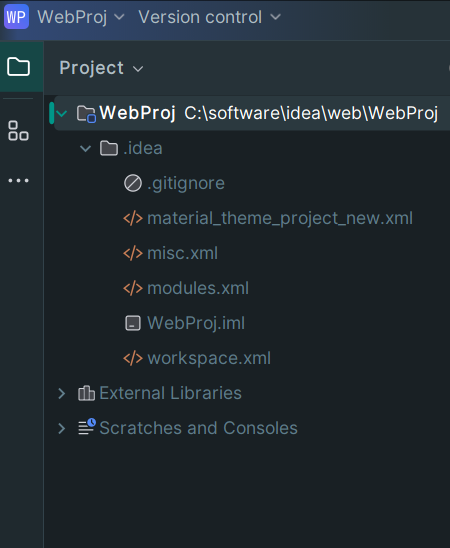

# Idea 新建 web 项目并发布

1. 创建一个空目录作为所有子 `module` 的根目录
2. 使用 `idea` 打开该目录

3. 为 `idea` 配置本地的 `tomcat`

4. 配置当前项目的 `jdk`，语言版本，编译产物的输出目录

5. 在根目录下创建新的 `java module`

得到空的java项目

6. 配置 java 项目为 java web 项目

> 1. 选中子module，搜索 `add framework support`

> 2. 添加 `web application` 支持，默认为 4.0 版本，由于当前tomcat版本为10+，因此需要使用更高版本的 `web application` 详见下面的步骤

> 3. 修改项目设置，为java module 配置 tomcat10 的依赖

> 4. 重新为module 添加 `web application` 的支持，此时可以看到 `web application` 版本变为 6.0

得到项目结构如下

7. 得到项目设置中的 `java module` 信息如下

8. 配置 tomcat

> 1. 右上角添加编辑运行配置

> 2. 新增 `tomcat server` 配置

> 3. tomcat server 默认信息分析

> 4. 添加 tomcat 部署的 artifact

> 5. 部署信息分析

8. 运行tomcat

访问项目

9. 新增 `Servlet` 并访问

> 1. 新增 `HelloServlet` 类继承自 `HttpServlet`

> 2. 新增 `HelloSevlet` 的 web 配置

> 3. 访问 `http://127.0.0.1:8080/Web01/hello_servlet`

