# `Servlet`

`Servlet (server applet)` 是运行在服务端 (`tomcat`) 的 java 小程序，是 sun 公司提供的一套定义动态资源规范，代码层面上 `servlet` 就是一个接口。

- 用来接收、处理客户端请求，响应给浏览器的动态资源。在整个 web 应用中，`servlet` 主要负责接收处理请求、协同调度功能以及响应数据。可以把 `servlet` 称为 `web` 应用中的控制器。
- 不是所有的 java 类都是用来处理客户端请求的，能处理客户端请求并作出响应的一套技术标准就是 `servlet`;
    - `servlet` 是运行在服务端的，所以 `servlet` 必须在 `web` 项目中开发且在 `tomcat` 这样的的服务容器中运行;

## `idea` 创建一个 `web` 项目

### 1. 为idea添加本地tomcat

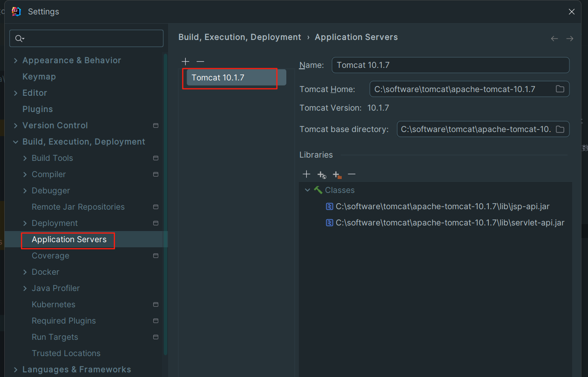

### 2. 创建 java 项目

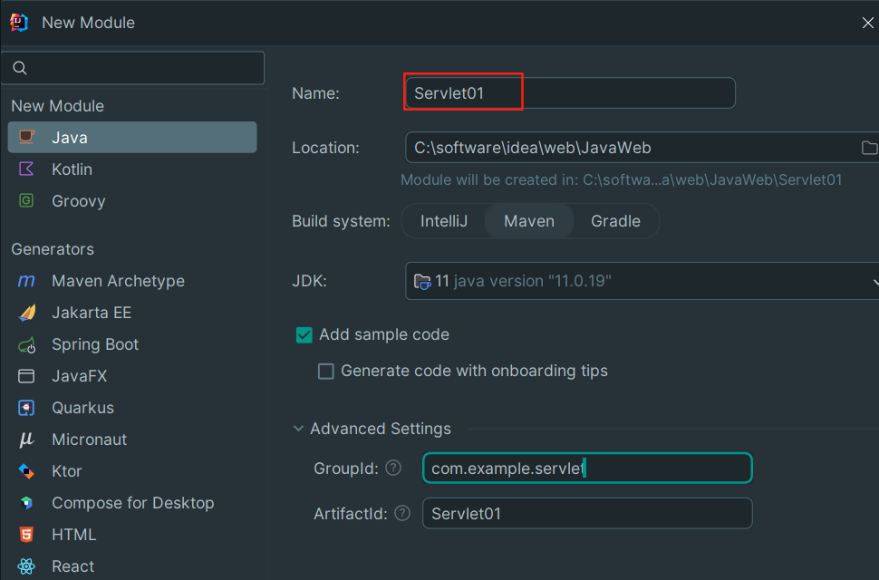

得到如下的java项目结构

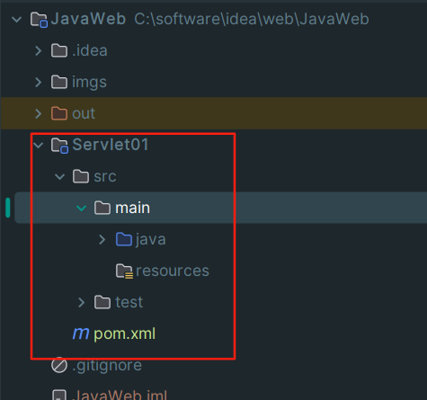

### 3. 为 java 项目添加web支持

1. 选中对应 module (当前为 `Servlet01`)，双击 `shift` 搜索 `add framework support`

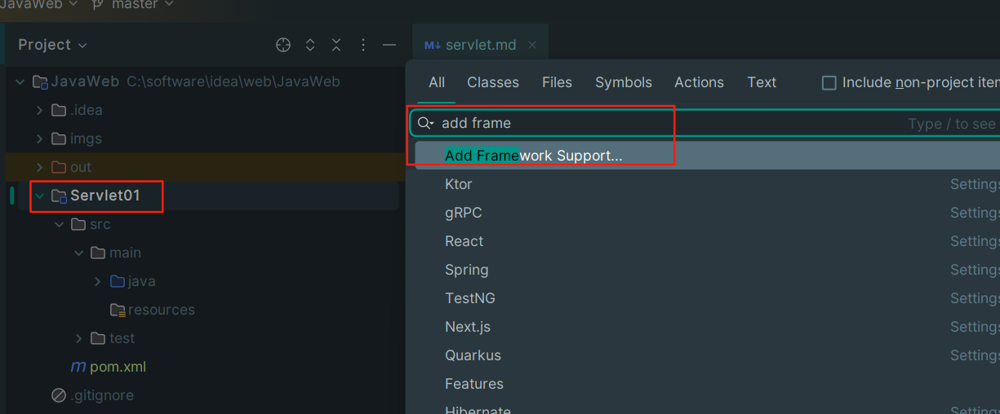

2. 选中 `web application` 选项

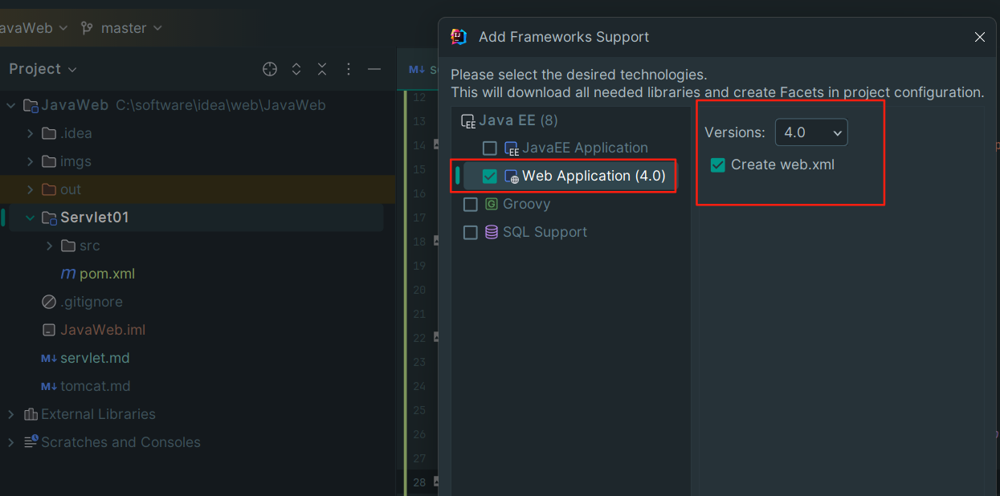

3. 得到如下目录结构

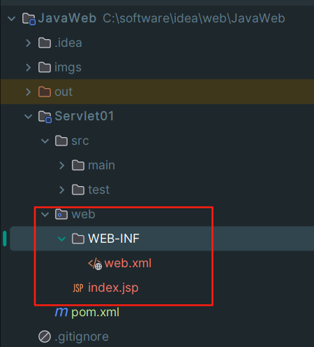

4. 添加本地 tomcat 配置

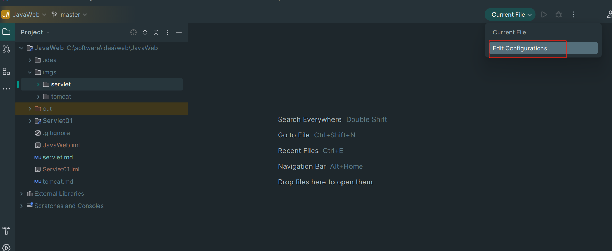

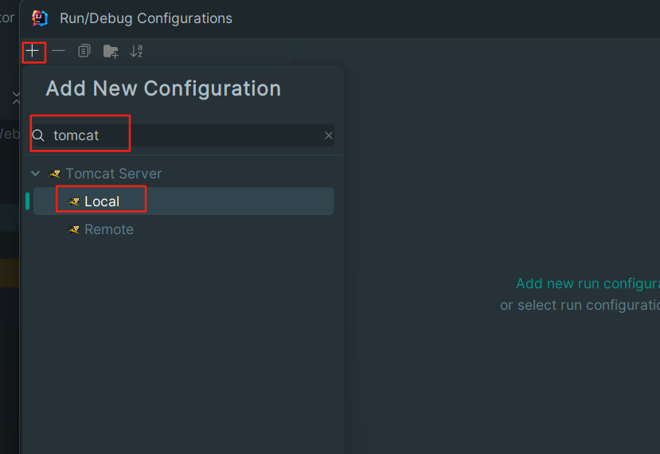

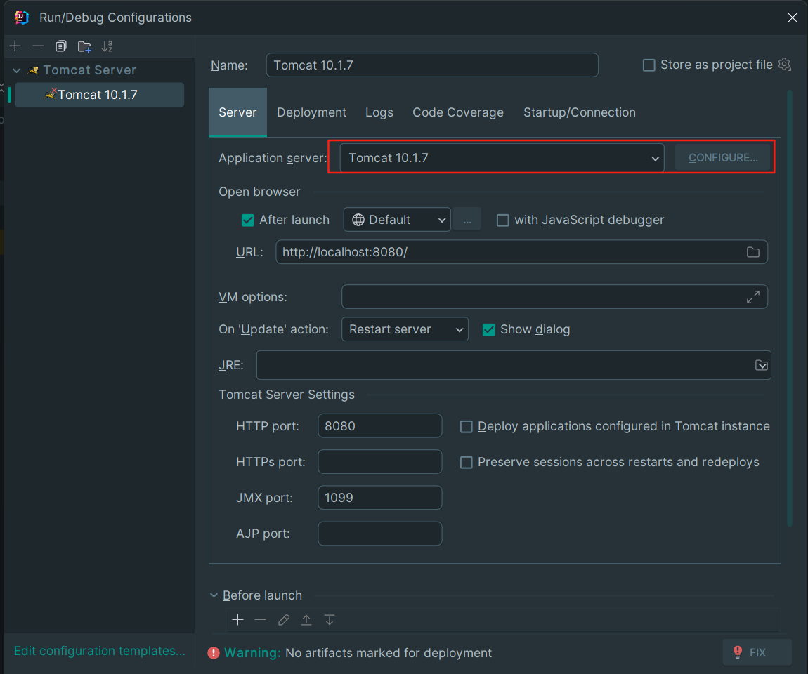

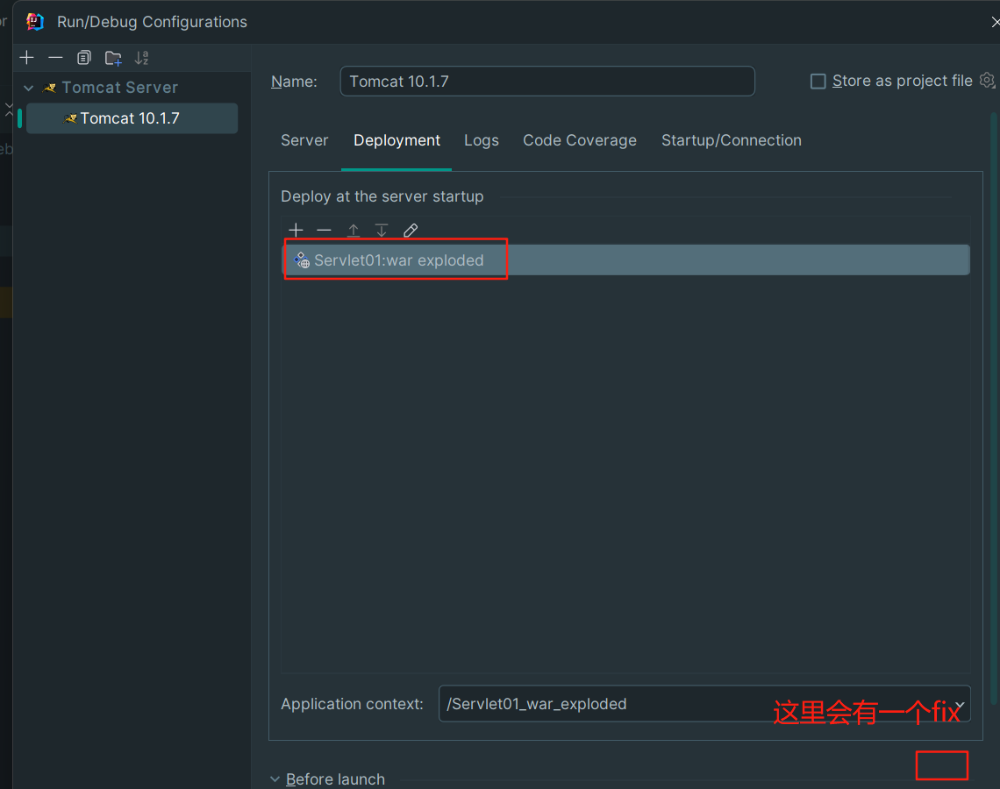

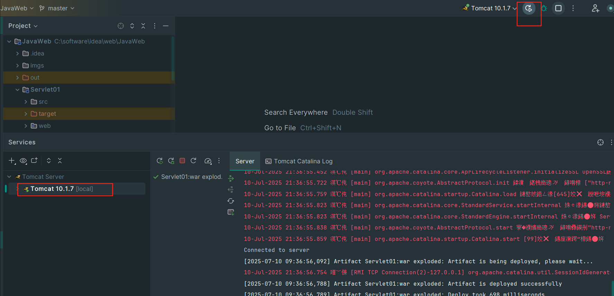

## `servlet` 开发流程

