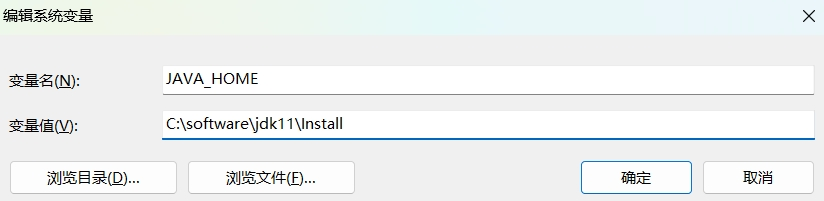
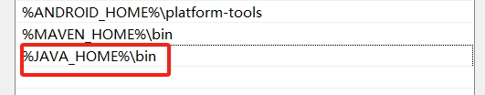
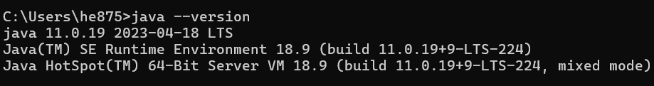
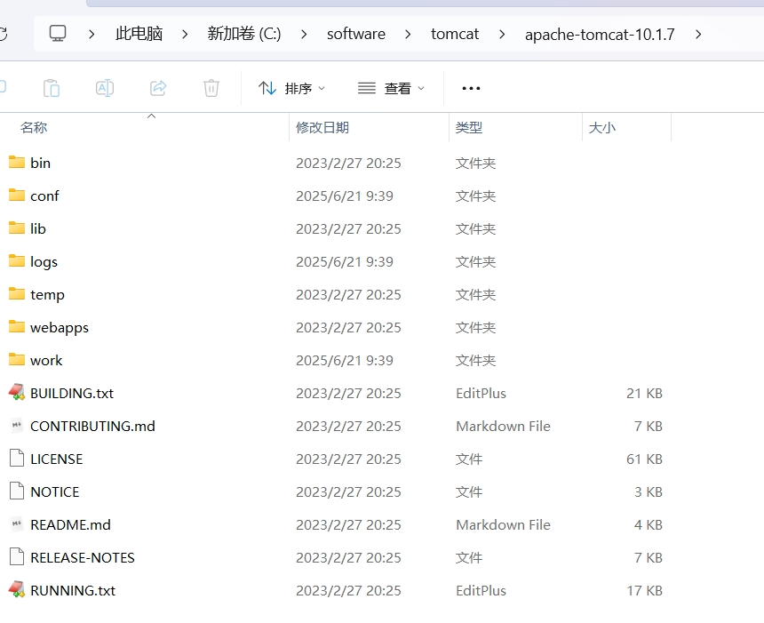
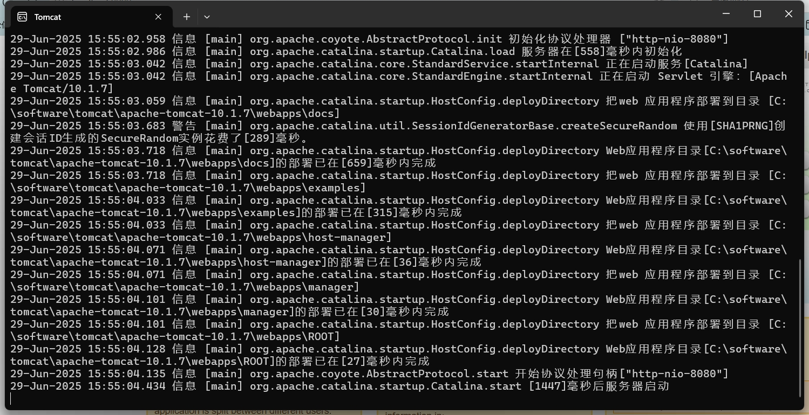
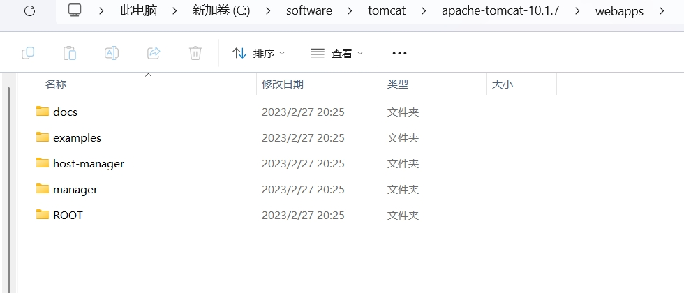

# 安装

1. 下载安装 `jdk`，并配置环境变量
    1. 华为云下载 `jdk` 地址 https://repo.huaweicloud.com:8443/artifactory/java-local/jdk/
    2. 配置 `jdk` 环境变量

   

   

    3. 验证环境变量

   

2. 下载 `tomcat` ,一般考虑下载解压版
    1. `tomcat` 下载地址 https://tomcat.apache.org/
    2. 解压 `tomcat` 到非中文无空格目录
      
   

3. 启动 `tomcat` 执行 `bin/startup.bat` 



> 解决windows下 tomcat 启动后乱码问题

- 打开配置文件 `conf/logging.properties`
- 修改对应编码为 `gbk`

```properties
# java.util.logging.ConsoleHandler.encoding = UTF-8
java.util.logging.ConsoleHandler.encoding = GBK
```

# `tomcat` 目录解析

`tomcat` 解压的目录 (例如:`C:\software\tomcat\apache-tomcat-10.1.7`) 称之为 `tomcat` 的安装目录或根目录;


> `bin` 目录

`bin` 目录存放的是二进制可执行文件，如果是安装版，那么这个目录下会有两个 `exe` 文件: `tomcat10.exe`、`tomcat10w.exe`，前者是控制台下启动 `tomcat`，后者是弹出 `GUI` 窗口启动 `tomcat`;

如果是解压版，那么会有 `startup.bat` 和 `shutdown.bat` 文件，`startup.bat` 用来启动 `tomcat`，但是需要先配置 `JAVA_HOME` 环境变量才能启动。`shutdown.bat` 用来停止 `tomcat`;

> `conf` 目录

`conf` 目录是一个非常重要的目录，这个目录下有四个最为重要的文件:

1. `server.xml`: 配置整个服务器信息。例如，修改端口号。(默认 `HTTP` 请求的端口号是 8080)
2. `tomcat-users.xml`: 存储 `tomcat` 用户的文件，这里保存的是 `tomcat` 的用户名和密码、以及用户的角色信息。可以按着该文件中的注释信息添加 `tomcat` 用户，然后就可以在 `tomcat` 主页中进入 `tomcat manager` 页面

```xml
<?xml version="1.0" encoding="UTF-8"?>
<tomcat-users xmlns="http://tomcat.apache.org/xml"
              xmlns:xsi="http://www.w3.org/2001/XMLSchema-instance"
              xsi:schemaLocation="http://tomcat.apache.org/xml tomcat-users.xsd"
              version="1.0">
...
  <role rolename="tomcat"/>
  <role rolename="role1"/>
  <user username="tomcat" password="<must-be-changed>" roles="tomcat"/>
  <user username="both" password="<must-be-changed>" roles="tomcat,role1"/>
  <user username="role1" password="<must-be-changed>" roles="role1"/>
</tomcat-users>
```

3. `web.xml`: `web.xml` 部署文件描述符，这个文件中注册了很多 `MIME` 类型，即文档类型。这些 `MIME` 类型是客户端与服务器之间说明文档类型的，如果用户请求一个 `html` 网页，那么服务器还会告诉客户端浏览器响应的文档是 `text/html` 类型的，这就是一个 `MIME` 类型。客户端浏览器通过这个 `MIME` 类型就知道如何处理它了。 如果服务器响应的是一个 `exe` 文件，那么浏览器不可能显示它，而是应该弹出下载窗口才对.
4. `context.xml`: 对应所有应用的统一配置，通常我们不会去配置他。

> `lib`

`tomcat` 的类库，里面是一大堆 `jar` 文件。如果需要添加 `tomcat` 依赖的 jar 文件，可以把它放到这个目录中，当然也可以把应用依赖的 jar 文件放到这个目录中。

`lib` 目录中的 `jar` 是所有项目都可以共享的，如果将应用的 `jar` 放到 `tomcat` 的 `lib` 目录中，那么该应用如果部署到其它 `tomcat` 下就会有问题，因此建议只把 `tomcat` 需要的 `jar` 包放到 `lib` 目录中。

> `logs`

这个目录都是日志文件，记录了 `tomcat` 启动和关闭的信息，如果启动 `tomcat` 时有错误，那么异常也会记录在日志文件中。

> `temp`

存放 `tomcat` 的临时文件，这个目录下的东西可以在停止 `tomcat` 后删除。

> `webapps`

存放 `web` 项目的目录，其中每一个文件夹都是一个项目。这个目录下默认存在的几个目录是 `tomcat` 自带的项目。其中 `ROOT` 是一个特殊的项目，在地址栏中访问 `http://127.0.0.1:8080`，没有给出项目目录时，对应的就是 `ROOT` 项目。

`http://127.0.0.1:8080/examples` 表示进入示例项目，其中 `examples` 就是项目名，及文件夹名字。




> `work`

运行时生成的文件，最终运行的文件都在这里。通过 `webapps` 中的项目生成的，可以把这个目录下的内删除，再次运行时会再次生成 work 目录。当客户端访问一个 `jsp` 文件时，`tomcat`会通过 `jsp` 生成 `java` 文件，然后再编译 `java` 文件生成 `class` 文件，这里的 `java` 文件和 `class` 文件都会存放到 `work` 目录下.

## `web` 项目的标准结构

```text
myapp/                         # 应用根目录
├── WEB-INF/                   # Tomcat 专用目录（外部无法访问）
│   ├── classes/               # Java 类文件（Servlet/Filters）
│   ├── lib/                   # 依赖库（JAR 文件）
│   └── web.xml                # 配置文件（Servlet 映射等）
│
├── static/                    # 🌟静态资源目录（推荐名称）
│   ├── css/                   # CSS 文件
│   │   └── main.[hash].css    # 带哈希的文件（缓存控制）
│   ├── js/                    # JavaScript 文件
│   │   ├── app.[hash].js      # 主应用文件
│   │   └── chunk.[hash].js   # 代码分割块
│   ├── images/                # 图片资源
│   │   └── logo.png
│   └── favicon.ico            # 网站图标
│
├── index.html                 # 前端主入口文件（必需）
│
├── api/                       # （可选）API 文档目录
│   └── openapi.json
│
└── robots.txt                 # 搜索引擎爬虫指令
```

# `HTTP` 协议

## 请求报文

客户端发送给服务端的报文，格式如下:

```text
请求首行 (请求行)  --> GET/POST 资源路径?参数 HTTP/1.1
请求头信息 (请求头)
空行
请求体

// get 请求，请求报文

GET /favicon.ico HTTP/1.1
Accept: image/avif,image/webp,image/apng,image/svg+xml,image/*,*/*;q=0.8
Accept-Encoding: gzip, deflate, br, zstd
...

// 请求头解析
-主机虚拟地址
Host: localhost:8080   -长连接
Connection: keep-alive -请求协议的自动升级 http的请求，服务器却是https的，浏览器自动会将请求协议升级为https的
Upgrade-Insecure- e uests: 1  - 用户系统信息
User-Agent: Mozilla/5.0 ( indows T 6.1; O 64) Apple eb it/537.36 ( HTML, like Gecko) 
Chrome/68.0.3440.75 Safari/537.36- 浏览器支持的文件类型
Accept:text/html,application/xhtml+xml,application/xml; =0.9,image/webp,image/apng,*/*
 ; =0.8- 当前页面的上一个页面的路径当前页面通过哪个页面跳转过来的：   可以通过此路径跳转回上一个页面， 广
告计费，防止盗链
eferer: http://localhost:8080/05_web_tomcat/login.html- 浏览器支持的压缩格式
Accept-Encoding: gzip, deflate, br- 浏览器支持的语言
Accept-Language: zh-C ,zh; =0.9,en-US; =0.8,en; =0.7
```

## 响应报文

```text
响应首行 (响应行)      -->     协议/版本 状态码 状态码描述
响应头信息 (响应头)
空行
响应体

// 响应报文

HTTP/1.1 200
Accept-Ranges: bytes
ETag: W/"21630-1677500728000"
Last-Modified: Mon, 27 Feb 2023 12:25:28 GMT
Content-Type: image/x-icon
Content-Length: 21630
Date: Fri, 04 Jul 2025 08:30:21 GMT
Keep-Alive: timeout=20
Connection: keep-alive
```


